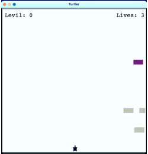

# Turtler
### Constructed in Python v3.9 using Turtle
 
_a reimagined frogger game_
  
 

The turtle starts at the bottom of the screen, which contains a horizontal road occupied by many speeding cars. The player must guide the turtle between opposing lanes of traffic to avoid becoming roadkill, which results in a loss of a life.  
See how many levels you can complete! The player starts with 3 lives and each successful road crossing is followed by an increase traffic speed. This game is not as easy as it sounds.

[_Click here to read about frogger and the origen of this game idea_](https://en.wikipedia.org/wiki/Frogger)

## Installation:

**With Python 3 using the console**
>1. Download the turtler folder 
>2. Place the folder into your python directory
>3. Open the console app and type: `python3 /<path to your python directory>/turtler/main.py`

 

**With Pycharm**
[_taken directly from the pycharm website_](https://www.jetbrains.com/help/pycharm/set-up-a-git-repository.html#put-existing-project-under-Git)

>1. From the main menu, select Git | Clone, or, if no project is currently opened, click Get from VCS on the Welcome screen.
>2. In the Get from Version Control dialog, specify the URL of the remote repository you want to clone, or select one of the VCS hosting services on the left.
>If you are already logged in to the selected hosting service, completion will suggest the list of available repositories that you can clone.
>3. Click Clone. If you want to create a project based on the sources you have cloned, click Yes in the confirmation dialog. Git root mapping will be automatically set to the project root directory.
>If your project contains submodules, they will also be cloned and automatically registered as project roots.

 

**Other _similar to pycharm_ integrated development environments (IDE)**

&nbsp;&nbsp;&nbsp;&nbsp; check the IDE creator's website for this specific information. Here are a few different ways you may find this information to be labeled._
>1. Check out a project from a remote host
>2. Clone a project from github
>3. Download files into application

## Use and Directions:

> **Use the arrow key to control the turtle**  
> _you can not move left right or back to avoid the traffic_  
> Use the ⬆︎ UP arrow key to cross the road  

## Enjoy!

## License

>**[View the MIT License agreement](LICENSE.md)**

>###     Copyright © 2021 Jim Bray and others,  &nbsp; All Rights Reserved
